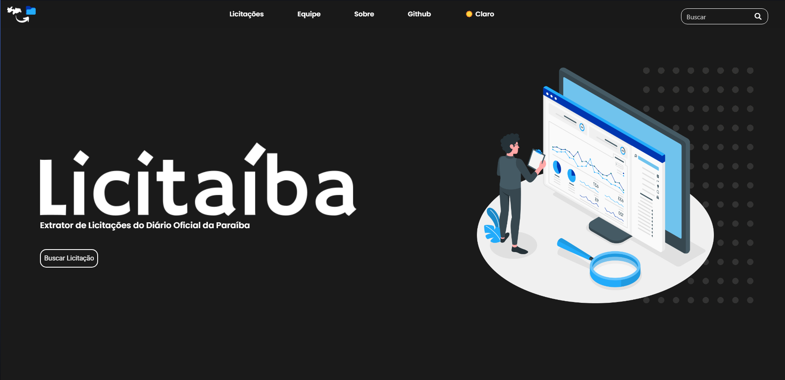
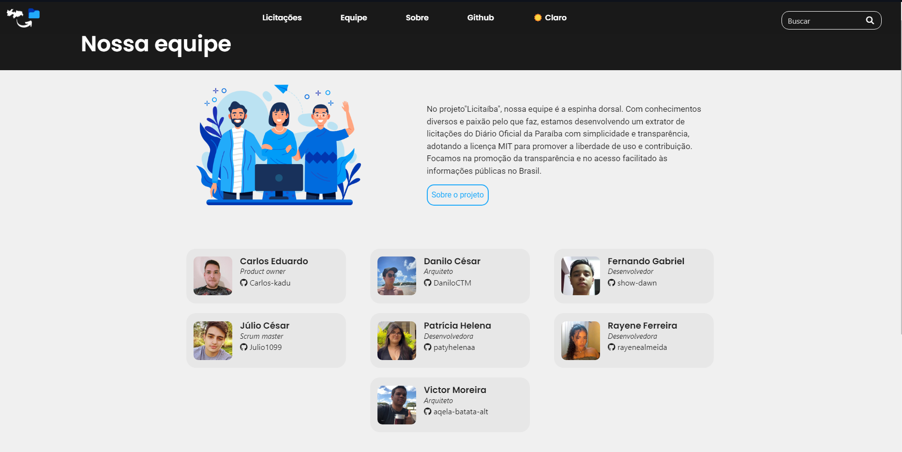
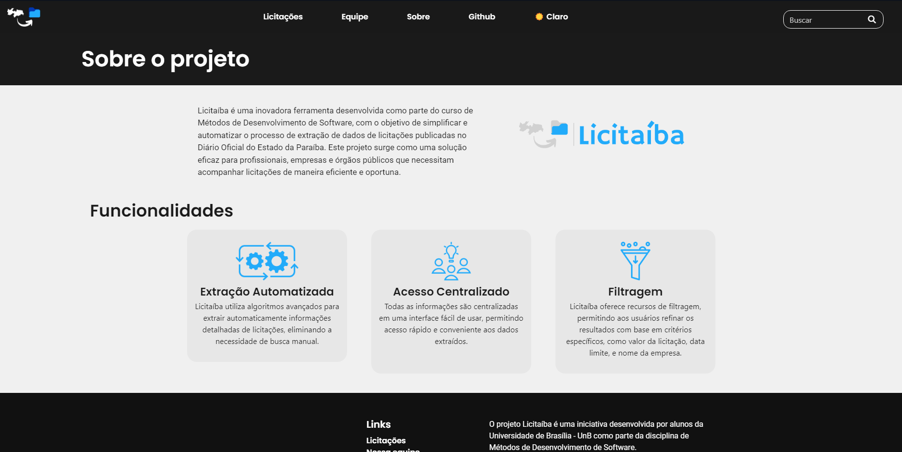

<!-- ADD O CONTEÚDO ABAIXO -->


# Licitaíba - Extrator de Licitações do Diário Oficial da Paraíba

<p align="center">

  <br>
  Logo do projeto Licitaíba
</p>

O projeto "Licitaíba" é uma iniciativa destinada a automatizar a coleta e o acompanhamento de informações relacionadas a licitações públicas no estado da Paraíba, Brasil.

<p align="center">
  
  <br>
  Bandeira da Paraíba
</p>

---

## 👨‍🔧 Tutorial para executar o Projeto "Licitaíba"
Este é um guia passo a passo para ajudar você a executar o projeto em sua máquina. Primeiramente você precisa entender como o projeto funciona. Cada script é rodado por agendamento de forma **automática** de segunda a sexta, seguindo uma ordem que deve ser respeitada, tudo isso ocorre pelo git actions.


- [Repositório front-end](https://github.com/unb-mds/2023.2_Licitaiba)
- [Documentação](https://unb-mds.github.io/2023-2-Squad04/#/./)
- [Post mortem](https://unb-mds.github.io/2023-2-Squad04/#/postmortem/postmortem)

### ⚠️ Pré-requisitos
- [Python v3.10.12 ou superior](https://www.python.org/downloads/)


### 1. ⏬ Clonar o Repositório
Para começar, abra o terminal e clone o repositório do GitHub em um diretório local da seguinte maneira:
```
git clone https://github.com/unb-mds/2023-2-Squad04.git
```

### 2. 🚢 Navegar até a pasta "src" 🗂️
Vamos entrar na pasta "src" do projeto usando o terminal. Certifique-se de estar na raiz do repositório clonado:
```
cd 2023-2-Squad04/src
```

### 3. 💻 Baixar pdfs de acordo com a última data resgistrada no pdf_downloader_last_date.txt
Nesse passo, o script de download sempre começa após a data posterior registrada no arquivo txt, ao concluir os downloads, o conteúdo do arquivo é atualizado com a data do último PDF baixado. O script está agendado para rodar às 08:00h., usando o seguinte comando:
```
python3 pdf_downloader.py
```

### 4. 📑 Listar o diretório src/pdfs/ e gravar em um txt todos os pdfs baixados
Essa é a segunda ação programada no repositório que ira ocorrer às 08:10hrs, usando o seguinte comando: 
```
python3 list_dir.py
```

### 5. 📖 Extração das licitações dos pdfs baixados no passo anterior
Seguindo a ordem, essa é a terceira ação programada que ocorrerá às 08:20hrs, usando o seguinte comando: 
```
python3 readpdf.py
```

### 6. 🌐 Contar a quantidade de licitações em cada municipio em todo os dados extraídos no arquivo json gerado pelo readpdf
Quarta ação programada que ocorrerá às 08:30hrs, usando o seguinte comando: 
```
python3 counter.py
```

### 7. 🗑️ Remoção dos Pdfs baixados
Quinto e último comando programado no repositório, que será acionado às 18:30hrs, usando o seguinte comando: 
```
python3 remove_pdf.py
```
<p align="center">
  
</p>
<p align="center">
  
</p> 
<p align="center">
  
</p> 
<p align="center">
  
</p> 
---

# Integrantes

| Foto| Nome  | Matrícula | Github | 
| ------ | --------- | ------- |----|
||Carlos Eduardo | 221031265 | [Carlos-kadu](https://github.com/Carlos-kadu)|
||Danilo César|221031149|[DaniloCTM](https://github.com/DaniloCTM)|
||Fernando Gabriel| 221008033|[show-dawn](https://github.com/show-dawn)|
||Júlio César| 221007591|[Julio1099](https://github.com/Julio1099)|
||Patrícia Helena|221037993|[patyhelenaa](https://github.com/patyhelenaa)|
||Rayene Ferreira|221022720|[rayenealmeida](https://github.com/rayenealmeida)|
||Victor Moreira|221008481|[aqela-batata-alt](https://github.com/aqela-batata-alt)|

# Papéis da equipe
|Nome|Papel|
|-----|-----|
|Scrum Master| Júlio|
|Arquitetos| Danilo e Victor|
|Product Owner|Carlos|
|Desenvolvedores|Fernando, Rayene e Patrícia|

<!-- ADD O CONTEÚDO ACIMA -->
</div>
